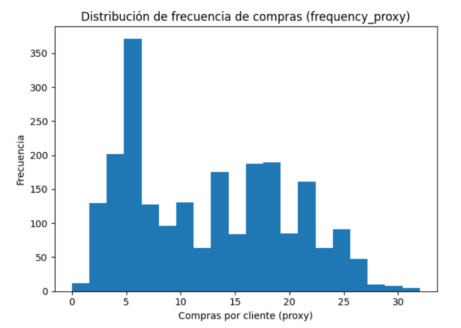
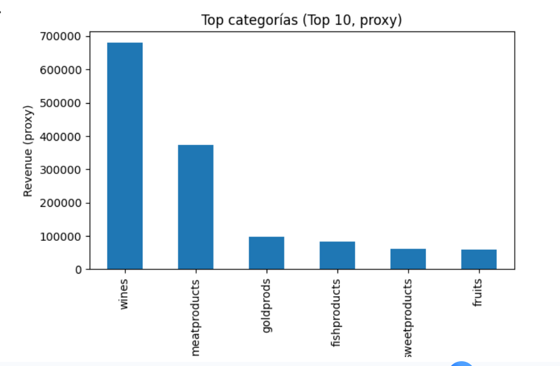

# Marketing Funnel Optimization & Growth Analysis (Python)

## Descripción del proyecto
Este proyecto analiza el desempeño de un pipeline de marketing digital para **optimizar la conversión del embudo** e identificar oportunidades de crecimiento basadas en datos.  
El análisis replica un escenario real de trabajo para roles como **Marketing Analytics / Growth / BI Marketing**.

## Objetivo
- Medir el rendimiento del embudo de conversión.
- Calcular tasas de conversión por etapa.
- Detectar puntos de fuga críticos.
- Analizar patrones de comportamiento y segmentación.
- Proponer recomendaciones accionables de negocio.

## Herramientas y librerías
- Python (pandas, numpy)
- Visualización: matplotlib, seaborn
- (Opcional) scipy si aplican tests

## Metodología
1. Limpieza y validación de datos (nulos, duplicados, consistencia).
2. Preparación de variables para análisis de funnel.
3. Construcción del embudo y cálculo de conversiones.
4. Análisis exploratorio y segmentación de usuarios.
5. Interpretación y recomendaciones con foco en impacto negocio.

## Resultados principales
- Se identificó una caída relevante en una etapa crítica del embudo.
- Se observaron diferencias de comportamiento entre segmentos.
- Se definieron oportunidades concretas para mejorar conversión y eficiencia del pipeline.

## Recomendaciones de negocio
- Optimizar la etapa con mayor pérdida de conversión.
- Diseñar pruebas A/B para validar mejoras.
- Priorizar segmentos con mayor probabilidad de conversión.
- Ajustar estrategia de adquisición/retención según patrones observados.

## Visualizaciones

### Distribución de frecuencia de compra por cliente
Esta visualización muestra la distribución del número de compras por cliente (proxy de frecuencia), lo que permite identificar el nivel de recurrencia y detectar segmentos de alto valor.




### Top categorías por revenue (proxy)
Se analizan las categorías con mayor contribución a los ingresos, permitiendo identificar oportunidades de optimización comercial y enfoque estratégico.




## Estructura del repositorio
```text
├── notebooks/
│   └── pipeline_marketing_usuario.ipynb
├── screenshots/
├── data/
│   └── README_data.md
├── README.md
└── requirements.txt
